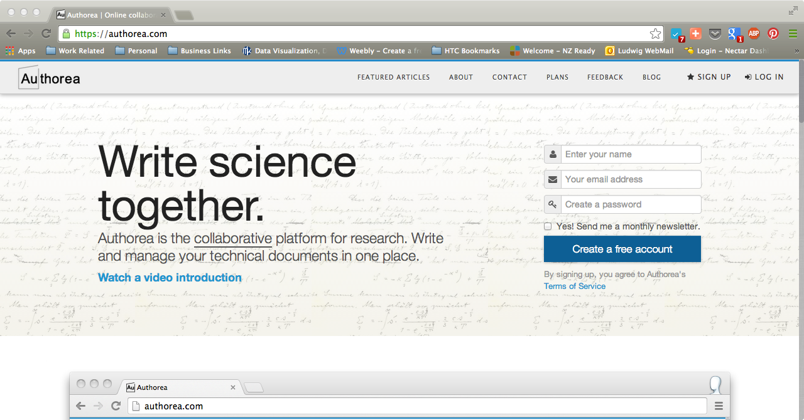

### Getting setup to use Authorea

Authorea is an online collaborative manuscript drafting application. To use it
one needs to register for an account (This is free). 

This is simply achieved from the homepage by entering your name, email address,
password and clicking on Create New Account

The free account gives you unlimited public documents and one private document.

A subscription fee allows you to have more private documents. Details can be 
found [here](https://authorea.com/user_plans)

Private documents are not visible on the web or to Authorea users, but only to 
those who are nominated as collaborators on the private document. 

It is worth filling in your profile details (Institution and role) as these
are automatically populated in the document upon output and formatting (Author
affilitations for example).
 

