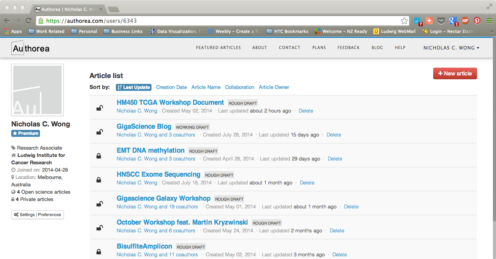
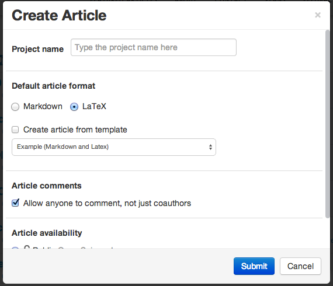
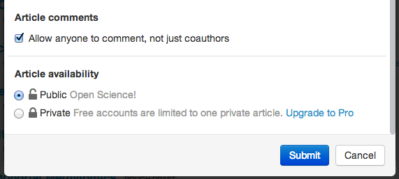

### Creating new Authorea documents.

Once an account has been created, you are taken to the homepage that lists
all documents you have created in Authorea.

Currently there are none, so to create a new document simply click on the New
Article Icon. 

This will take you to a new window where you enter in the details of your 
new document. 

+ Give your document a name in the Project Title field.
+ Set the format of your article, it can be in Markdown or in LaTeX (We will be using LaTeX).
+ You can use a set template to create an article, select from dropdown menu.
+ Toggle article commenting. 
+ Toggle article availability.
  +  you can select private, where only you and your coauthors are the only people that can view it. Or, you select public, which is viewable to anybody. On a free account, only one private article is allowed.
+ Click submit.

Congratulations you have created your first Authorea document and you will
be presented with the edit window.

##### Challenge   
Create a new public article and one private article. Give both distinct 
titles. eg: "My First Public Manuscript" and "My First Private Manuscript". Go back
to the main manuscript page. What is the difference? Ask your buddy if they can
search and find your public manuscript by searching the title. Now ask them to find 
your private manuscript. Can they find it?

----  
Next you will learn how to [add collaborators.](../03_AddCollaborators/addCollaborators.md)
