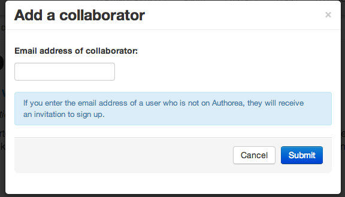

### Adding collaborators to your draft document.

Of course you can draft your own manuscripts and share them by making them
public. Most research is done collaboratively and the power of Authorea
is the ability to share, edit and track the changes of a manuscript in a 
better way than Microsoft Word for instance. 

To begin sharing your manuscript (and allowing access if the manuscript is
set to private) you can add a collaborator.

The collaborator does not need to already have an Authorea account, they 
would be sent an invitation to join. However, in order to collaborate, you
must have a Authorea account.

**Challenge**  
Add a collaborator to your public manuscript. What do you
see? What happens when your collaborator accepts? Now add a collaborator
to your private manuscript. Can that collaborator now see and search for
your manuscript?

If your collaborator has an exisiting Authorea account they have to be linked
by using the email address they used to set up their account. Authorea then
finds their account and then adds the draft document to their own list of 
documents in Authorea. 

Now your collaborator can do the following things to your manuscript: 

* Commenting
* Editing
* Comparing
* Sharing

----  
Lets get onto [drafting a manuscript next.](../04_DraftingLatex/draftingLatex.md)
