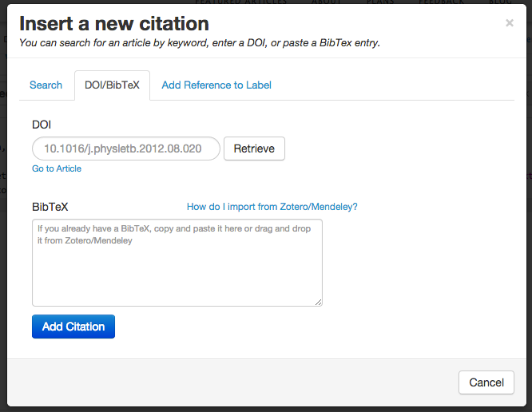
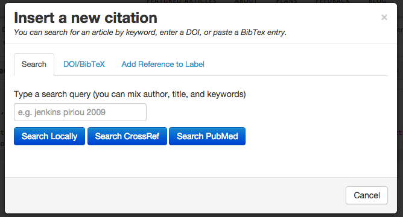

###Inserting citations
Authorea can insert citations and associated bibliography through the insert citation button within the document in the document editor (+)

Once you click the insert citation button, you have the option of inserting the DOI of the paper you want to cite.

or serach for your paper through PubMed or other citation search engines.

Authorea will then in the background insert your citation and format your bioliography according to the output
format you specifiy.

The citation is created as BibTex bibilography file and this can be found in the folders tab of your manuscript, you can also paste in a BibTex citation as well. 

Cross referencing your citations, simply copy and paste the encoded citation created to other sentences in the document.

** Challenge ** : Use Authorea add citation to search for your paper that you want to cite. Add it to your manuscript.
Copy and past the reference to other sentences or other parts of your manuscript. 
