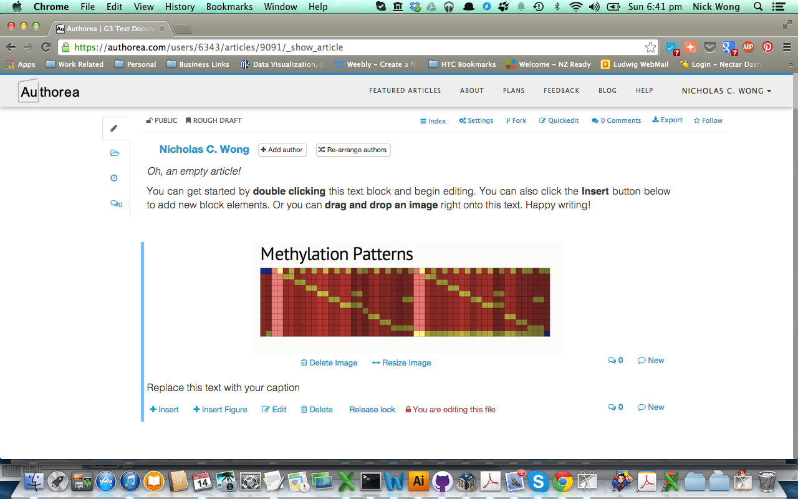
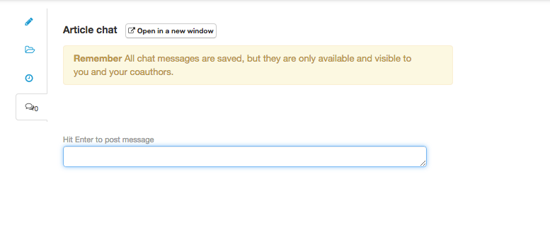

### Collaborative editing of a document.

To collaborate and share a mannscript, simply add an author to your manuscript and enter their email address. 
They will have access to the manuscript and can edit and change it.

To track and see the changes, look in the history tab.

You can lock certain parts of your document from other collaborators that may want to edit it. This
function is activated if you are actively editing a section in your manuscript. 

You can "track changes" to the document in a Git styled manner through the history tab. It is helpful 
to comment on your changes/edits.

It is also possible use chat as a means of communicating to your co-authors.

##### Challenge

Lock a section of your manuscript and see if your co-author can edit it or not from their computer. Initiate a chat 
and incourge your co-author to edit the manuscript. Click on the history tab and see what your co-author did.

----  
Next up is [commenting on a manuscript](../09_commenting/commenting.md)
