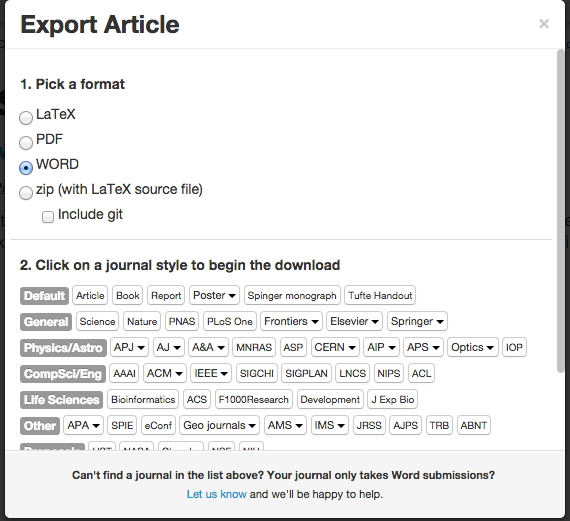

### Exporting your manuscript for publication

There are a number of options for exporting your document. After clicking the export button in the top right hand corner, simply pick a format you'd like to export to (PDF, Word or LaTeX source code), then click on the journal style you're after.

If the journal you're looking for isn't on the list, you can email the Authorea team and ask for it to be added, or simply download the raw LaTeX source code and compile it yourself (i.e. after installing LaTeX on your own computer).

##### Challenge 

Export your document into your favourite format or style. Look at the output, now go back and export to a different 
format/style. Can you see how easy it is?
